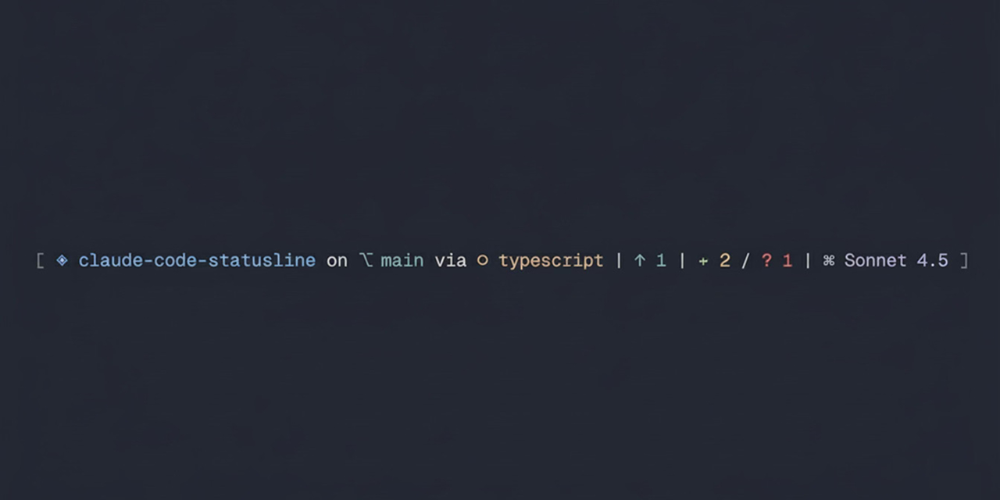

# create-claude-statusline

Beautiful, highly customizable status line for Claude Code with granular control over every element.

<picture>
  <source srcset=".github/assets/claude-code-statusline-promo.gif" type="image/gif">
  
</picture>

## Quick Start

```bash
npm create claude-statusline
```

*Adds a beautiful status line to your Claude Code. ZERO dependencies in your project.*

## What You Get

```
[ ◈ my-project on ⎇ main via ◉ React (node) | ↑ 2 / + 1 / ~ 3 / ? 2 | ⌘ Sonnet 4.5 ]
```

- Project name, git branch, framework, and runtime
- Commit status (ahead/behind)
- Git status indicators (staged, modified, untracked)
- Current Claude model
- Fully customizable: toggle any element, change colors, swap icons

## Installation

```bash
npm create claude-statusline
```

Or with other package managers:
```bash
npx create-claude-statusline           # npx
pnpm dlx create-claude-statusline      # pnpm
bunx create-claude-statusline          # bun
```

Global install:
```bash
npm install -g create-claude-statusline
create-claude-statusline  # or use alias: ccs
```

## Customization

Edit `.claude/scripts/statusline-config.cjs` to customize:

### Feature Toggles
```javascript
FEATURES: {
  SHOW_PROJECT: true,        // Show project name
  SHOW_GIT_BRANCH: true,     // Show git branch
  SHOW_FRAMEWORK: true,      // Show detected framework (React, Vue, etc.)
  SHOW_RUNTIME: true,        // Show runtime (Node.js, Bun, etc.)
  SHOW_GIT_AHEAD: true,      // Show commits ahead of remote
  SHOW_GIT_BEHIND: true,     // Show commits behind remote
  SHOW_GIT_STAGED: true,     // Show staged files
  SHOW_GIT_MODIFIED: true,   // Show modified (unstaged) files
  SHOW_GIT_UNTRACKED: true,  // Show untracked files
  SHOW_MODEL: true,          // Show Claude model name
}
```

### Colors

Color scheme follows an intuitive severity gradient:

```javascript
COLORS: {
  PROJECT: '\x1b[38;5;110m',       // Muted steel blue
  BRANCH: '\x1b[38;5;109m',        // Slate gray-blue
  FRAMEWORK: '\x1b[38;5;145m',     // Cool gray
  RUNTIME: '\x1b[38;5;180m',       // Muted beige
  GIT_AHEAD: '\x1b[38;5;109m',     // Slate blue
  GIT_BEHIND: '\x1b[38;5;167m',    // Soft coral
  GIT_STAGED: '\x1b[38;5;108m',    // Muted teal-green
  GIT_MODIFIED: '\x1b[38;5;180m',  // Muted amber
  GIT_UNTRACKED: '\x1b[38;5;167m', // Soft coral
  MODEL: '\x1b[38;5;146m',         // Soft gray-green
}
```

### Icons
```javascript
ICONS: {
  PROJECT: '◈',
  BRANCH: '⎇',
  GIT_AHEAD: '↑',
  GIT_BEHIND: '↓',
  GIT_STAGED: '+',
  GIT_MODIFIED: '~',
  GIT_UNTRACKED: '?',
  MODEL: '⌘'
}
```

### Supported Frameworks & Runtimes

**Frameworks:** `Next.js`, `Nuxt.js`, `NestJS`, `React`, `Vue`, `Angular`, `Svelte`, `Express`, `Fastify`

**Runtimes:** `Node.js`, `Bun`, `TypeScript`, `Python`, `Rust`, `Go`, `Java`, `C/C++`

All configuration is centralized in `.claude/scripts/statusline-config.cjs` - one file to control everything!

## Safety

Your existing `.claude` directory is automatically backed up to `.create-claude-statusline-backup-[timestamp]` before installation.

## Uninstall

```bash
rm -rf .claude/scripts/statusline*.cjs
```

Then remove the `"statusLine"` section from `.claude/settings.local.json`.

## License

MIT © [RMNCLDYO](https://github.com/RMNCLDYO)
